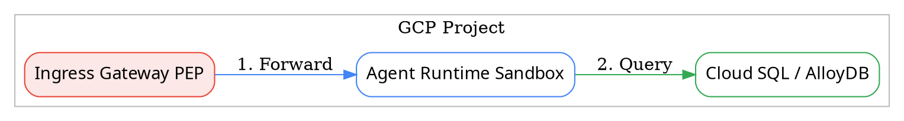
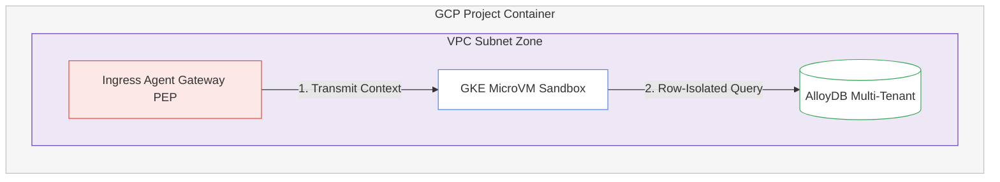

# Codebase Analysis & Multi-Format Diagram Export Guide

This reference specifies how AI agents auto-discover infrastructure code and export diagrams in multiple formats (SVG, Interactive HTML, Graphviz DOT, and Mermaid JS).

---

## 1. Codebase Infrastructure Scanning Protocol (Mode A)

When requested to analyze or scan a codebase to generate an architecture diagram, agents must search for infrastructure definitions in the following order:

### A. Terraform (`*.tf`)
* Search terms: `resource "google_compute_*"`", `resource "google_sql_database_instance"`, `resource "google_container_cluster"`, `resource "google_cloud_run_v2_service"`, `resource "google_vpc_access_connector"`, `resource "google_kms_crypto_key"`.
* Map resources to 6-Tier Architecture Grid and container boundaries.

### B. Kubernetes Manifests & Helm (`*.yaml`, `*.yml`)
* Search terms: `kind: Deployment`, `kind: StatefulSet`, `gvisor`, `runtimeClassName: gvisor`, `istio`, `VirtualService`, `NetworkPolicy`.
* Extract pods, services, and network isolation policies.

### C. Cloud Run & Serverless (`service.yaml`)
* Extract container images, IAM invoker bindings, VPC connectors, and egress controls.

### D. Application Code (Python / TypeScript / Go)
* Search for Google GenAI / Vertex AI SDK usages (`VertexAI`, `GenAI`, `Agent`, `LangChain`, `LlamaIndex`, `MCP`).
* Identify agent tool bindings, database connections, and model endpoints.

---

## 2. Multi-Format Deliverable Export Options

Agents support 4 output formats depending on user preference:

### Format 1: Standalone Scalable Vector Graphics (SVG)
* Default format matching Google Cloud Architecture Center.
* Wrapped in standard `<svg viewBox="0 0 1200 600" xmlns="http://www.w3.org/2000/svg">`.
* Standard Google Sans typography, clear layers `<g id="...">`.

### Format 2: Interactive HTML Split-Screen Dashboard
* Embedded in `index.html`.
* Left Panel: SVG Canvas with click/hover listeners.
* Right Panel: Deep-dive sidebar displaying architecture specs, security controls, and code snippets.

### Format 3: Graphviz DOT Code
For g3doc documentation and version-controlled diagrams:



### Format 4: Mermaid JS
For GitHub Markdown rendering:



#### Puppeteer Sandbox Override for Mermaid CLI (`mmdc`)
When executing `mmdc` in headless Linux or sandbox environments, pass `-p puppeteer-config.json` containing:
```json
{
  "args": ["--no-sandbox", "--disable-setuid-sandbox"]
}
```

### Format 5: High-Definition AI Image Asset (`generate_image`)
For presentation-ready, high-resolution raster image generation anchored by official GCP category icons:

* **Execution Tool**: `generate_image`
* **Style Anchors (`ImagePaths`)**: Select up to 3 local category PNG icons from `.agents/skills/google-cloud-architecture-diagram/assets/category-icons/Category Icons/`.
* **Prompt Instructions**: Specify flat 2D vector style, Google Cloud Architecture Center palette tokens (`#1A73E8`, `#4284F3`, `#34A853`, `#EA4335`, `#F9AB00`), clean 2:1 aspect ratio, and 6-tier grid layout.

